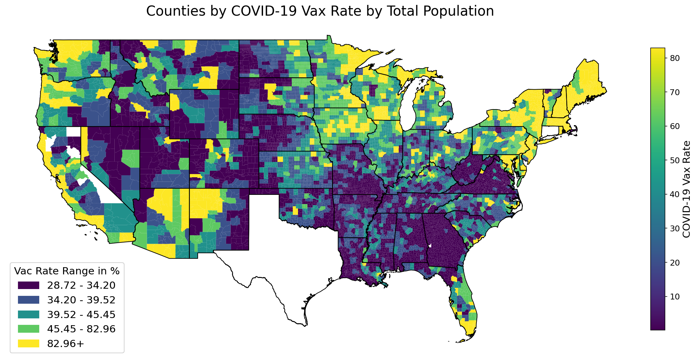
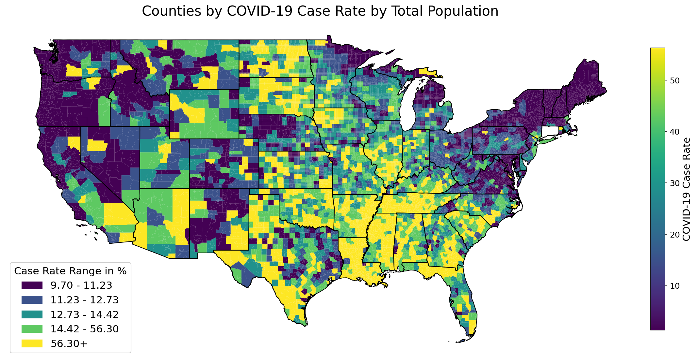
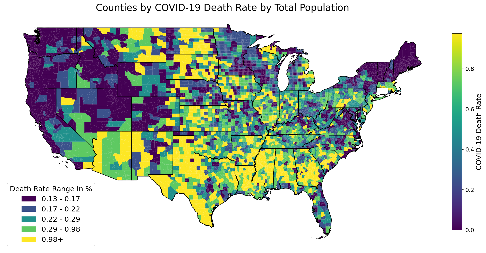

The COVID pandemic quickly spread worldwide in 2020 and still persists today. The disease is spread by infected
particles emitted from an infected person’s mouth or nose, and particles can vary in size from larger droplets to
smaller aerosol particles. The best mitigation strategy against COVID is vaccination; however, vaccines have become
politically contentious. There is a statistically significant correlation between political ideology and vaccination rate in
a county. Political leaning is the most influential factor on vaccination rates and is associated with level of belief
in vaccine science. During initial research, we failed to discover an existing mathematical model that synthesizes
political vaccination patterns with epidemiology dynamics. Our model attempts to reflect the effects of individuals’
political leanings, as well as simulate inter-county mobility, and show how they affect COVID dynamics.

Project by: Chloe Comeau, Marcus Cruz, Nicholas Thompson
Mentors: Carlos Bustamante2,Tirthkumar Shah and Paula Gonzalez Parra
Emails:
Marcus Cruz <mcruz53@asu.edu>,
Chloe Comeau <ccomeau1@asu.edu>,
Nicholas Thompson <nsthomp5@asu.edu>,
Carlos Enrique Bustamante Orellana <cbustam3@asu.edu>,
Tirthkumar Shah <tshah34@asu.edu>
Paula GONZALEZ PARRA <pagonzal@asu.edu>
Licence: QRLSSP 2024

